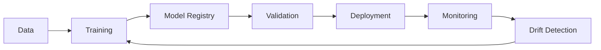

# 📚 Sentiment Analysis MLOps - Complete Documentation

This document provides comprehensive documentation for the Sentiment Analysis MLOps platform.

## 📑 Table of Contents

- [Development Setup](#-development-setup)
- [Training Your Own Models](#-training-your-own-models)
- [API Reference](#-api-reference)
- [Configuration](#%EF%B8%8F-configuration)
- [Docker & Deployment](#-docker--deployment)
- [Monitoring & Metrics](#-monitoring--metrics)
- [Testing](#-testing)
- [CI/CD Pipelines](#-cicd-pipelines)
- [Project Architecture](#-project-architecture)
- [File Reference](#-file-reference)
- [Troubleshooting](#-troubleshooting)
- [Contributing](#-contributing)

## 💻 Development Setup

### Prerequisites

- Python 3.10+
- Git
- Docker (optional, for containerized deployment)

### Installation

1. **Clone the repository**

   ```bash
   git clone <repository-url>
   cd sentiment-analysis-mlops
   ```

2. **Create virtual environment**

   ```bash
   python -m venv mlops
   source mlops/bin/activate  # On Windows: mlops\Scripts\activate
   ```

3. **Install dependencies**

   ```bash
   make install
   ```

4. **Run the application**
   ```bash
   make run-app
   ```

The Gradio interface will be available at `http://localhost:7860`.

### 🚀 Available Make Commands

The project includes several handy commands to make development easier:

```bash
# 📦 Setup & Dependencies
make install          # Install all dependencies and setup pre-commit hooks

# 🏃‍♂️ Running the Application
make run-app           # Start the Gradio web interface
make train             # Train a new sentiment analysis model
make evaluate          # Evaluate a trained model
make deploy            # Deploy to production

# 🧪 Testing & Quality
make test              # Run all tests with coverage report
make lint              # Check code quality (flake8, mypy)
make format            # Auto-format code (black, isort)
make clean             # Clean up cache files and build artifacts

# 🐳 Docker Operations
make docker-build      # Build Docker image
make docker-run        # Run application in Docker container
make docker-teardown   # Teardown Docker containers

# 💡 Get Help
make help              # Show all available commands
```

**Pro tip for beginners**: Always run `make lint && make test` before pushing your changes to ensure everything is working correctly!

## 🏋️ Training Your Own Models

The project includes a complete training pipeline! You can train your own sentiment analysis model using the provided configuration files.

### Quick Training Setup

1. **Configure training parameters** in `configs/training_config.yaml`:

```yaml
model:
  base_model: "distilbert-base-uncased"
  max_length: 512
  num_labels: 2

training:
  output_dir: "./models/sentiment"
  epochs: 3
  batch_size: 16
  learning_rate: 2e-5
  warmup_steps: 500
  weight_decay: 0.01

data:
  dataset: "glue"
  task: "sst2"
  train_split: "train"
  eval_splits: "validation"
```

2. **Start training**:

```bash
make train
```

That's it! The training script will:

- Load the SST-2 dataset automatically
- Fine-tune DistilBERT for sentiment analysis
- Track experiments with MLflow
- Save the best model based on F1 score
- Register the model in the MLflow model registry

### Training Tips for Beginners

- **Start small**: The default config uses 3 epochs which is perfect for testing
- **Monitor progress**: Check `http://localhost:5003` for MLflow tracking UI
- **GPU recommended**: Training will be much faster with a GPU, but CPU works too
- **Experiment freely**: Try different learning rates (1e-5, 2e-5, 5e-5) in the config file

## 🔧 API Reference

The project provides **two ways** to interact with the sentiment analysis model:

1. **🎨 Gradio Web Interface** - Perfect for testing and demos
2. **🔧 FastAPI REST API** - Ideal for integrating with other applications

### REST API Endpoints

Start the FastAPI server:

```bash
# Run the API server
python src/api/inference.py

# API will be available at http://localhost:8000
# Interactive docs at http://localhost:8000/docs
```

#### Batch Prediction (Recommended)

```python
POST /predict
Content-Type: application/json

{
  "texts": ["I love this product!", "This is terrible"],
  "return_probabilities": true
}

# Response
{
  "predictions": [
    {
      "sentiment": "positive",
      "confidence": 0.9234,
      "probabilities": {"positive": 0.9234, "negative": 0.0766}
    },
    {
      "sentiment": "negative",
      "confidence": 0.8543,
      "probabilities": {"positive": 0.1457, "negative": 0.8543}
    }
  ],
  "model_version": "distilbert-base-uncased",
  "timestamp": "2024-01-15T10:30:00"
}
```

#### Health Check

```python
GET /health

# Response
{
  "status": "healthy",
  "model_loaded": true,
  "timestamp": "2024-01-15T10:30:00"
}
```

#### Real-time Metrics

```python
GET /metrics

# Response
{
  "total_predictions": 1542,
  "average_confidence": 0.8234,
  "positive_ratio": 0.62,
  "drift_status": {
    "drift_detected": false,
    "drift_score": 0.023
  }
}
```

#### Model Information

```python
GET /model/info

# Response
{
  "model_name": "distilbert-base-uncased",
  "model_version": "v1.0.0",
  "labels": ["negative", "positive"],
  "max_length": 512
}
```

### Quick API Testing

```bash
# Test the health endpoint
curl http://localhost:8000/health

# Test prediction with curl
curl -X POST "http://localhost:8000/predict" \
  -H "Content-Type: application/json" \
  -d '{"texts": ["This API is amazing!"], "return_probabilities": true}'

# Check metrics
curl http://localhost:8000/metrics
```

### 💡 API Usage Examples for Beginners

Here are some practical examples to get you started with the API:

#### Python Client Example

```python
import requests
import json

# Start by testing the health endpoint
response = requests.get("http://localhost:8000/health")
print("API Status:", response.json())

# Analyze a single piece of text
data = {
    "texts": ["I absolutely love this new feature!"],
    "return_probabilities": True
}

response = requests.post(
    "http://localhost:8000/predict",
    headers={"Content-Type": "application/json"},
    data=json.dumps(data)
)

result = response.json()
print("Sentiment:", result["predictions"][0]["sentiment"])
print("Confidence:", result["predictions"][0]["confidence"])
```

#### Batch Processing Example

```python
# Analyze multiple texts at once (more efficient!)
customer_reviews = [
    "Great product, fast shipping!",
    "Quality could be better for the price",
    "Amazing customer service, highly recommend!",
    "Product didn't meet expectations"
]

data = {
    "texts": customer_reviews,
    "return_probabilities": False  # Skip probabilities for faster response
}

response = requests.post("http://localhost:8000/predict", json=data)
predictions = response.json()["predictions"]

for review, pred in zip(customer_reviews, predictions):
    print(f"Review: {review[:50]}...")
    print(f"Sentiment: {pred['sentiment']} (confidence: {pred['confidence']:.2f})")
    print("---")
```

#### Integration with pandas

```python
import pandas as pd

# Load your data
df = pd.read_csv("customer_feedback.csv")

# Analyze sentiments
texts_batch = df["feedback_text"].tolist()
response = requests.post(
    "http://localhost:8000/predict",
    json={"texts": texts_batch}
)

# Add results to dataframe
predictions = response.json()["predictions"]
df["sentiment"] = [p["sentiment"] for p in predictions]
df["confidence"] = [p["confidence"] for p in predictions]

# Save results
df.to_csv("analyzed_feedback.csv", index=False)
print("Analysis complete! Check analyzed_feedback.csv")
```

### Gradio Interface Features

1. **Single Prediction Tab**

   - Text input for sentiment analysis
   - Real-time confidence visualization
   - Performance metrics display
   - Monitoring toggle

2. **Batch Analysis Tab**

   - CSV file upload
   - Batch processing results
   - Sentiment distribution charts
   - Confidence histograms

3. **Model Info Tab**
   - Model metadata
   - System configuration
   - MLOps features overview

## ⚙️ Configuration

### Environment Variables

```bash
# Model Configuration
MODEL_NAME=distilbert-base-uncased-finetuned-sst-2-english
MAX_LENGTH=512
BATCH_SIZE=32

# Monitoring
PROMETHEUS_PORT=9090
METRICS_ENABLED=true
DRIFT_THRESHOLD=0.05

# MLflow
MLFLOW_TRACKING_URI=sqlite:///mlflow.db
EXPERIMENT_NAME=sentiment-analysis

# Gradio
GRADIO_SERVER_NAME=0.0.0.0
GRADIO_SERVER_PORT=7860
```

### Model Configuration

```python
# src/models/sentiment_model.py
@dataclass
class ModelConfig:
    model_name: str = "distilbert-base-uncased-finetuned-sst-2-english"
    max_length: int = 512
    batch_size: int = 32
    device: str = "cuda" if torch.cuda.is_available() else "cpu"
```

### Monitoring Configuration

```python
# src/monitoring/drift_detection.py
class DriftDetector:
    def __init__(self, window_size: int = 1000, threshold: float = 0.05):
        # Configuration for drift detection
```

## 🐳 Docker & Deployment

### Build Docker Image

```bash
make docker-build
```

### Run with Docker Compose (Recommended)

```bash
# Start all services (Gradio + FastAPI + MLflow)
docker-compose -f docker/docker-compose.yml up

# Or run in background
docker-compose -f docker/docker-compose.yml up -d

# Stop all services
docker-compose -f docker/docker-compose.yml down
```

This will start:

- **Gradio Web UI**: http://localhost:7860
- **FastAPI Server**: http://localhost:8000
- **MLflow Tracking**: http://localhost:5003

### Single Container (Gradio only)

```bash
# Build and run just the Gradio interface
make docker-build
make docker-run
```

### Docker Compose Services

The Docker Compose setup includes:

- **App**: Gradio web interface (port 7860)
- **API**: FastAPI REST endpoints (port 8000)
- **MLflow**: Experiment tracking server (port 5003)
- **Prometheus**: Metrics collection (optional)
- **Grafana**: Monitoring dashboards (optional)

## 📊 Monitoring & Metrics

### Prometheus Metrics

The system exposes the following metrics:

- `prediction_total`: Total number of predictions
- `prediction_duration_seconds`: Prediction latency histogram
- `model_confidence`: Confidence score distribution
- `active_models`: Number of active model instances

### Key Performance Indicators

1. **Latency Metrics**

   - Average response time
   - P95/P99 latency percentiles
   - Request throughput

2. **Model Performance**

   - Prediction confidence distribution
   - Sentiment prediction ratios
   - Error rates

3. **System Health**
   - Memory usage
   - CPU utilization
   - Model loading status

### Accessing Metrics

```bash
# Prometheus metrics endpoint
curl http://localhost:9090/metrics

# Application health check
curl http://localhost:7860/health
```

### Grafana Dashboard (Optional)

If using the full Docker Compose setup with Grafana:

1. Access Grafana at `http://localhost:3000`
2. Default credentials: `admin/admin`
3. Import the provided dashboard template
4. Configure Prometheus data source

## 🧪 Testing

### Test Structure

The project includes three types of tests:

1. **Unit Tests** (`tests/unit/`)
   - Model inference testing
   - Individual component validation
   - Mocked dependencies

2. **Integration Tests** (`tests/integration/`)
   - API endpoint testing
   - Full request/response cycles
   - Database interactions

3. **Performance Tests** (`tests/performance/`)
   - Latency benchmarks
   - Throughput testing
   - Resource utilization

### Running Tests

```bash
# Run all tests with coverage
make test

# Unit tests only
pytest tests/unit/ -v

# Integration tests (API tests)
pytest tests/integration/ -v

# Performance benchmarks
pytest tests/performance/ -v --benchmark

# With detailed coverage report
pytest tests/ -v --cov=src --cov-report=html
pytest tests/ -v --cov=src --cov-report=term-missing
```

### Writing New Tests

#### Unit Test Example
```python
# tests/unit/test_model.py
def test_sentiment_prediction():
    model = SentimentModel()
    result = model.predict(["I love this!"])
    assert result[0]["sentiment"] == "positive"
    assert result[0]["confidence"] > 0.8
```

#### Integration Test Example
```python
# tests/integration/test_api.py
def test_predict_endpoint():
    client = TestClient(app)
    response = client.post(
        "/predict",
        json={"texts": ["Great product!"]}
    )
    assert response.status_code == 200
    assert "predictions" in response.json()
```

#### Performance Test Example
```python
# tests/performance/test_latency.py
@pytest.mark.benchmark
def test_inference_latency(benchmark):
    model = SentimentModel()
    text = "Test sentiment" * 50  # Long text
    result = benchmark(model.predict, [text])
    assert result is not None
```

### Code Quality

```bash
# Run linting (flake8 + mypy)
make lint

# Auto-format code (black + isort)
make format

# Security scan
make security-scan

# Full quality check before commit
make lint && make format && make test
```

## 🆕 CI/CD Pipelines

The project includes GitHub Actions workflows for continuous integration and deployment:

### Workflow Files

1. **Model Validation** (`.github/workflows/model_validation.yml`)
   - Runs daily or on-demand
   - Downloads test data
   - Evaluates model performance
   - Checks for model drift
   - Generates validation reports
   - Sends alerts on failure

2. **CI Pipeline** (`.github/workflows/ci.yml`)
   - Triggered on push/PR
   - Runs tests
   - Checks code quality
   - Builds Docker images
   - Validates configurations

3. **CD Pipeline** (`.github/workflows/cd.yml`)
   - Deploys to staging/production
   - Runs smoke tests
   - Monitors deployment health
   - Supports rollback

### Setting Up CI/CD

1. **Configure Secrets**
   ```
   SLACK_WEBHOOK: For notifications
   DOCKER_REGISTRY: Container registry
   AWS_ACCESS_KEY_ID: For cloud deployment
   AWS_SECRET_ACCESS_KEY: For cloud deployment
   ```

2. **Customize Workflows**
   - Adjust cron schedules
   - Modify deployment targets
   - Add custom validation steps

## 🏗️ Project Architecture

```
sentiment-analysis-mlops/
├── app/
│   └── gradio_app.py          # Gradio web interface
├── src/
│   ├── api/
│   │   └── inference.py       # FastAPI REST API endpoints
│   ├── models/
│   │   ├── sentiment_model.py # Core ML model
│   │   └── model_registry.py  # MLflow integration
│   └── monitoring/
│       ├── metrics.py         # Prometheus metrics
│       └── drift_detection.py # Statistical monitoring
├── configs/
│   ├── training_config.yaml   # Training configuration
│   └── deployment_config.yaml # Deployment settings
├── scripts/
│   ├── train.py              # Model training script
│   ├── evaluate.py           # Model evaluation script
│   ├── deploy.py             # Deployment automation
│   └── generate_report.py    # Report generation
├── docker/
│   ├── Dockerfile            # Container definition
│   ├── docker-compose.yml    # Multi-service setup
│   ├── prometheus.yml        # Metrics configuration
│   └── alerts.yml           # Alert rules
├── tests/
│   ├── unit/                 # Unit tests
│   │   └── test_model.py     # Model testing
│   ├── integration/          # Integration tests
│   │   └── test_api.py       # API testing
│   └── performance/          # Performance tests
│       └── test_latency.py   # Latency benchmarks
├── .github/
│   └── workflows/            # CI/CD pipelines
│       └── model_validation.yml # Automated validation
├── notebooks/
│   └── 01_exploration.ipynb  # Data exploration
├── data/
│   └── sample_data.csv       # Example dataset
├── results/                  # Analysis outputs
│   ├── error_analysis.csv
│   └── performance_analysis.csv
├── requirements/
│   ├── base.txt             # Production dependencies
│   └── dev.txt              # Development dependencies
├── setup.py                 # Package setup
├── Makefile                 # Build and deployment commands
├── README.md                # Main overview and quick start
└── DOCS.md                  # This comprehensive documentation
```

## 📚 File Reference

### New Files Added

#### Scripts (`scripts/`)
- **`evaluate.py`**: Evaluates trained models against test datasets, generates performance metrics
- **`deploy.py`**: Automates deployment to staging/production environments
- **`generate_report.py`**: Creates HTML/PDF reports from evaluation results

#### Configuration (`configs/`)
- **`deployment_config.yaml`**: Defines deployment targets, resource limits, scaling policies

#### Docker (`docker/`)
- **`prometheus.yml`**: Configures Prometheus scraping targets and intervals
- **`alerts.yml`**: Defines alert rules for system health and model performance

#### Tests
- **`tests/integration/test_api.py`**: Tests all API endpoints with various payloads
- **`tests/performance/test_latency.py`**: Benchmarks inference latency under load

#### CI/CD (`.github/workflows/`)
- **`model_validation.yml`**: Automated daily validation of model performance

#### Data & Results
- **`data/sample_data.csv`**: Example dataset for testing
- **`results/error_analysis.csv`**: Model error analysis output
- **`results/performance_analysis.csv`**: Performance metrics over time

#### Other
- **`setup.py`**: Package installation configuration

## 🔄 MLOps Pipeline Architecture



## 🚀 Production Deployment

### Staging Deployment

```bash
# Deploy to staging environment
make deploy-staging

# Run staging tests
make test-staging
```

### Production Deployment

```bash
# Deploy to production
make deploy-production

# Monitor deployment
make monitor-deployment
```

### Deployment Checklist

- [ ] All tests passing
- [ ] Model performance validated
- [ ] Security scan completed
- [ ] Monitoring configured
- [ ] Rollback plan prepared
- [ ] Documentation updated

### Blue-Green Deployment

The system supports blue-green deployments for zero-downtime updates:

1. Deploy new version to green environment
2. Run health checks and validation
3. Switch traffic from blue to green
4. Monitor metrics and rollback if needed

## 🆘 Troubleshooting

### Common Issues

1. **CUDA/GPU Issues**

   ```bash
   # Force CPU usage
   export CUDA_VISIBLE_DEVICES=""
   ```

2. **Memory Issues**

   ```bash
   # Reduce batch size in config
   export BATCH_SIZE=16
   ```

3. **Model Loading Errors**

   ```bash
   # Clear Hugging Face cache
   rm -rf ~/.cache/huggingface/
   ```

4. **Port Conflicts**

   ```bash
   # Use different port
   export GRADIO_SERVER_PORT=7861
   ```

5. **MLflow Parameter Conflict Error**

   If you get `MlflowException: Changing param values is not allowed`, delete the problematic run:

   ```bash
   # End any existing MLflow runs
   python -c "import mlflow; mlflow.end_run()"
   ```

6. **Docker Compose Issues**

   ```bash
   # Reset Docker Compose
   docker-compose -f docker/docker-compose.yml down
   docker-compose -f docker/docker-compose.yml up -d

   # Check container logs
   docker-compose -f docker/docker-compose.yml logs
   ```

### Getting Help

- **Documentation**: Check this DOCS.md file first
- **Issues**: Report bugs on GitHub Issues
- **Examples**: See API usage examples above
- **Community**: Join discussions in GitHub Discussions

## 🤝 Contributing

### Development Workflow

1. Fork the repository
2. Create a feature branch: `git checkout -b feature/amazing-feature`
3. Make your changes
4. Run tests: `make test`
5. Run code quality checks: `make lint && make format`
6. Commit your changes: `git commit -m 'Add amazing feature'`
7. Push to the branch: `git push origin feature/amazing-feature`
8. Open a Pull Request

### Code Standards

- Use `black` for code formatting
- Use `flake8` for linting
- Add type hints where appropriate
- Write tests for new features
- Update documentation

### Areas for Consideration

- [ ] Additional model architectures (BERT, RoBERTa)
- [ ] More evaluation metrics
- [ ] Enhanced monitoring dashboards
- [ ] Performance optimizations
- [ ] Documentation improvements
- [ ] Integration examples
