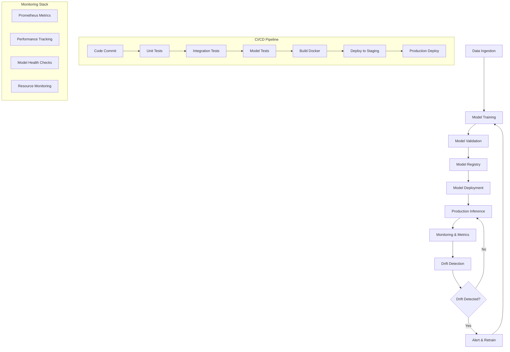

# 🚀 Sentiment Analysis MLOps Platform

A production-ready sentiment analysis system built with modern MLOps practices, featuring real-time inference, monitoring, and CI/CD pipelines.

## 📖 Overview

This project demonstrates a complete MLOps implementation for sentiment analysis using Hugging Face transformers, with comprehensive monitoring, drift detection, and deployment automation. The system provides both single prediction and batch processing capabilities through an intuitive Gradio interface.

### Key Features

- 🤖 **Production ML Model**: DistilBERT-based sentiment analysis
- 📊 **Real-time Monitoring**: Prometheus metrics & performance tracking
- 🎯 **Drift Detection**: Statistical monitoring for model degradation
- 🔄 **Model Registry**: MLflow for versioning and deployment
- 🐳 **Containerized Deployment**: Docker & Docker Compose
- 🧪 **Comprehensive Testing**: Unit and integration tests
- 📈 **Interactive UI**: Gradio-based web interface

## 🚀 Quick Start with GitHub Codespaces

[](https://codespaces.new)

1. Click the Codespaces badge above or navigate to your repository
2. Click "Code" → "Codespaces" → "Create codespace on main"
3. Wait for the environment to set up (2-3 minutes)
4. Install dependencies:
   ```bash
   make install
   ```
5. Run the application:
   ```bash
   make run-app
   ```
6. Open the Gradio interface at `http://localhost:7860`

## 💻 Local Development Setup

### Prerequisites

- Python 3.10+
- Git
- Docker (optional, for containerized deployment)

### Installation

1. **Clone the repository**

   ```bash
   git clone <repository-url>
   cd sentiment-analysis-mlops
   ```

2. **Create virtual environment**

   ```bash
   python -m venv mlops
   source mlops/bin/activate  # On Windows: mlops\Scripts\activate
   ```

3. **Install dependencies**

   ```bash
   make install
   ```

4. **Run the application**
   ```bash
   make run-app
   ```

The Gradio interface will be available at `http://localhost:7860`.

## 🔄 MLOps Pipeline Architecture



## 🧪 Running Tests

### Unit Tests

```bash
make test
```

### Specific Test Categories

```bash
# Unit tests only
pytest tests/unit/ -v

# Integration tests only
pytest tests/integration/ -v

# With coverage report
pytest tests/ -v --cov=src --cov-report=html
```

### Code Quality

```bash
# Run linting
make lint

# Format code
make format

# Full quality check
make lint && make format && make test
```

## 🐳 Docker Deployment

### Build Docker Image

```bash
make docker-build
```

### Run with Docker

```bash
# Single container
docker run -p 7860:7860 sentiment-mlops:latest

# With Docker Compose (recommended)
make docker-run
```

### Docker Compose Services

The Docker Compose setup includes:

- **App**: Gradio web interface
- **Prometheus**: Metrics collection
- **Grafana**: Monitoring dashboards (optional)

## 📚 API Documentation

### Core Endpoints

#### Single Prediction

```python
POST /predict
Content-Type: application/json

{
  "text": "I love this product!",
  "enable_monitoring": true
}

# Response
{
  "sentiment": "positive",
  "confidence": 0.9234,
  "probabilities": {
    "positive": 0.9234,
    "negative": 0.0766
  }
}
```

#### Batch Prediction

```python
POST /predict/batch
Content-Type: application/json

{
  "texts": ["Great service!", "Terrible experience"],
  "enable_monitoring": true
}
```

#### Health Check

```python
GET /health

# Response
{
  "status": "healthy",
  "model_loaded": true,
  "uptime": "2h 34m 12s"
}
```

### Gradio Interface Features

1. **Single Prediction Tab**

   - Text input for sentiment analysis
   - Real-time confidence visualization
   - Performance metrics display
   - Monitoring toggle

2. **Batch Analysis Tab**

   - CSV file upload
   - Batch processing results
   - Sentiment distribution charts
   - Confidence histograms

3. **Model Info Tab**
   - Model metadata
   - System configuration
   - MLOps features overview

## ⚙️ Configuration

### Environment Variables

```bash
# Model Configuration
MODEL_NAME=distilbert-base-uncased-finetuned-sst-2-english
MAX_LENGTH=512
BATCH_SIZE=32

# Monitoring
PROMETHEUS_PORT=9090
METRICS_ENABLED=true
DRIFT_THRESHOLD=0.05

# MLflow
MLFLOW_TRACKING_URI=sqlite:///mlflow.db
EXPERIMENT_NAME=sentiment-analysis

# Gradio
GRADIO_SERVER_NAME=0.0.0.0
GRADIO_SERVER_PORT=7860
```

### Model Configuration

```python
# src/models/sentiment_model.py
@dataclass
class ModelConfig:
    model_name: str = "distilbert-base-uncased-finetuned-sst-2-english"
    max_length: int = 512
    batch_size: int = 32
    device: str = "cuda" if torch.cuda.is_available() else "cpu"
```

### Monitoring Configuration

```python
# src/monitoring/drift_detection.py
class DriftDetector:
    def __init__(self, window_size: int = 1000, threshold: float = 0.05):
        # Configuration for drift detection
```

## 📊 Monitoring & Dashboards

### Prometheus Metrics

The system exposes the following metrics:

- `prediction_total`: Total number of predictions
- `prediction_duration_seconds`: Prediction latency histogram
- `model_confidence`: Confidence score distribution
- `active_models`: Number of active model instances

### Key Performance Indicators

1. **Latency Metrics**

   - Average response time
   - P95/P99 latency percentiles
   - Request throughput

2. **Model Performance**

   - Prediction confidence distribution
   - Sentiment prediction ratios
   - Error rates

3. **System Health**
   - Memory usage
   - CPU utilization
   - Model loading status

### Accessing Metrics

```bash
# Prometheus metrics endpoint
curl http://localhost:9090/metrics

# Application health check
curl http://localhost:7860/health
```

### Grafana Dashboard (Optional)

If using the full Docker Compose setup with Grafana:

1. Access Grafana at `http://localhost:3000`
2. Default credentials: `admin/admin`
3. Import the provided dashboard template
4. Configure Prometheus data source

## 🚀 Production Deployment

### Staging Deployment

```bash
# Deploy to staging environment
make deploy-staging

# Run staging tests
make test-staging
```

### Production Deployment

```bash
# Deploy to production
make deploy-production

# Monitor deployment
make monitor-deployment
```

### Deployment Checklist

- [ ] All tests passing
- [ ] Model performance validated
- [ ] Security scan completed
- [ ] Monitoring configured
- [ ] Rollback plan prepared
- [ ] Documentation updated

### Blue-Green Deployment

The system supports blue-green deployments for zero-downtime updates:

1. Deploy new version to green environment
2. Run health checks and validation
3. Switch traffic from blue to green
4. Monitor metrics and rollback if needed

## 🏗️ Project Structure

```
sentiment-analysis-mlops/
├── app/
│   └── gradio_app.py          # Gradio web interface
├── src/
│   ├── models/
│   │   ├── sentiment_model.py # Core ML model
│   │   └── model_registry.py  # MLflow integration
│   └── monitoring/
│       ├── metrics.py         # Prometheus metrics
│       └── drift_detection.py # Statistical monitoring
├── tests/
│   ├── unit/                  # Unit tests
│   └── integration/           # Integration tests
├── requirements/
│   ├── base.txt              # Production dependencies
│   └── dev.txt               # Development dependencies
├── Dockerfile                # Container definition
├── Makefile                  # Build and deployment commands
└── README.md                 # This file
```

## 🆘 Troubleshooting

### Common Issues

1. **CUDA/GPU Issues**

   ```bash
   # Force CPU usage
   export CUDA_VISIBLE_DEVICES=""
   ```

2. **Memory Issues**

   ```bash
   # Reduce batch size in config
   export BATCH_SIZE=16
   ```

3. **Model Loading Errors**

   ```bash
   # Clear Hugging Face cache
   rm -rf ~/.cache/huggingface/
   ```

4. **Port Conflicts**
   ```bash
   # Use different port
   export GRADIO_SERVER_PORT=7861
   ```
